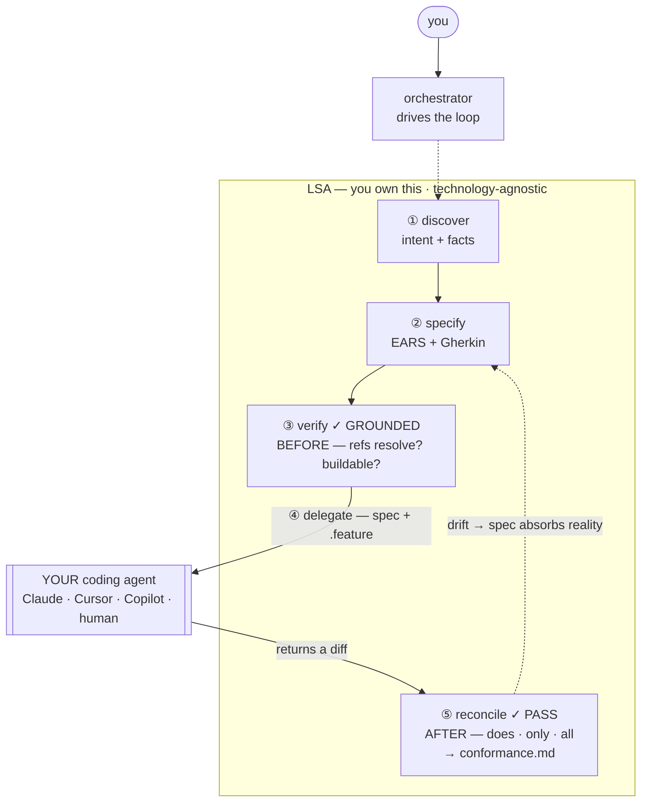

# LSA — Living Spec Architecture

> **A technology-agnostic spec layer: ground the spec in your codebase *before* you build, verify the diff *after*. Bring your own coding agent.**

AI coding agents are fast but unanchored — specs live in chat, drift from the codebase, and nobody checks the diff against what was agreed. LSA owns the two ends no coder agent does:

- **`verify` (before)** — every reference in the spec resolves to real code; every flow is buildable. No fantasy specs.
- **`reconcile` (after)** — the returned diff is checked **does · only · all** against the spec, and drift is absorbed.

The agent in the middle is yours: **Claude Code, Cursor, Copilot, or a human.** LSA never writes production code.

> [!NOTE]
> LSA is **not** a coding agent — it's the spec-and-verification layer that wraps one. It adopts industry-standard formats (**EARS** for requirements, **Gherkin** for acceptance) so it interoperates with Spec Kit, Kiro, and Cursor instead of competing with them.

**Contents:** [The loop](#the-loop) · [Quick start](#quick-start) · [How LSA compares](#how-lsa-compares) · [Skills](#skills) · [The two checks](#the-two-checks--the-product) · [Standards](#standards) · [Configuration](#configuration) · [Install](#install)

## The loop

`discover → specify → verify → delegate → reconcile`, driven by the `orchestrator`. Ceremony scales to weight — a typo skips the spec; a new feature runs the full spine.



**A run, end to end:**

```text
> /lsa:discover "add a /status command that lists in-flight features"
[discover] intent + facts — roadmap.md exists @ .lsa/roadmap.md; one read-only flow.

> /lsa:specify
[specify] F1 (EARS): WHEN status runs, the system SHALL print in-flight features.
          status.feature: Given the roadmap has in-flight rows / When status runs / Then a table is printed.

> /lsa:verify                         ← the BEFORE check (ground vs codebase)
[verify] GROUNDED — roadmap reader exists @ src/roadmap.ts:12; flow buildable.

> /lsa:delegate                       ← hand off to YOUR agent
[delegate] spec + status.feature → your implementer. Awaiting the diff…

> /lsa:reconcile                      ← the AFTER check (does · only · all)
[reconcile] does ✓ 5/5 runs · only ✓ hunks trace to F1 · all ✓ F1 covered
            → PASS + conformance.md
```

## Quick start

```
/plugin marketplace add NVZver/claude-marketplace
/plugin install core@NVZver
/plugin install lsa@NVZver
```

1. **Initialize** — `/lsa:init` scaffolds the spec tree (greenfield or brownfield).
2. **Discover** — `/lsa:discover "<what you want>"` extracts intent + gathers codebase facts.
3. **Specify** — `/lsa:specify` writes EARS requirements + Gherkin `.feature` scenarios.
4. **Verify** — `/lsa:verify` grounds the spec against your codebase; fix anything `NOT-GROUNDED` before building.
5. **Delegate** — `/lsa:delegate` hands the spec to your coding agent.
6. **Reconcile** — `/lsa:reconcile` checks the returned diff **does · only · all** and writes `conformance.md`.

> [!TIP]
> You don't have to run the steps by hand — talk to the `orchestrator` and it drives the whole loop, resolving each step's inputs via `discover`.

## How LSA compares

LSA deliberately does **less** than a full SDD toolkit — it owns the two grounding checks and delegates everything else, so it layers *on top of* the others rather than replacing them.

| | **LSA** | Spec Kit | OpenSpec | Kiro |
|---|---|---|---|---|
| Writes the code | ✗ — bring any agent | ✓ orchestrates | via your agent | ✓ (AWS IDE) |
| Tool-agnostic | ✓ | ✓ | ✓ | ✗ |
| Grounds the spec in the codebase *before* build | ✓ `verify` | — | — | partial |
| Verifies the diff vs the spec *after* (does · only · all) | ✓ `reconcile` (blocking) | — | `/opsx:verify` — non-blocking, no hunk trace | — |
| Permanent, drift-absorbing spec | ✓ | branch-per-change | ✓ living `specs/` (delta-merge) | ✓ |
| Formats | EARS + Gherkin | spec / plan / tasks | change proposals | EARS |

*LSA's read of the landscape — see [Spec Kit](https://github.com/github/spec-kit), [OpenSpec](https://github.com/Fission-AI/OpenSpec), [Kiro](https://kiro.dev). You can run LSA's `verify` / `reconcile` on top of any of them.*

OpenSpec is the closest neighbour: it ships an after-the-fact `/opsx:verify` and a living `specs/` set merged via deltas, so it is no more drift-prone than LSA. LSA's edge is narrower and specific — `reconcile` is a **blocking PASS gate** (`/opsx:verify` "won't block archive, but it surfaces issues"), its `only` check maps **every changed hunk to a requirement**, and its `does` check runs each Gherkin scenario **N times for ≥95%**. OpenSpec's verify is single-pass and non-blocking with no hunk→requirement trace.

## Skills

| Skill | Purpose |
|---|---|
| **`discover`** | Extract user intent and gather the codebase facts the spec rests on. Also the universal input-resolver other skills call. |
| **`specify`** | Write the grounded spec — EARS requirements, user flows, and Gherkin `.feature` scenarios. |
| **`verify`** | **Before** delegating: ground the spec against the codebase. Output: `GROUNDED` / `NOT-GROUNDED` + `grounding.md`. |
| **`delegate`** | Hand the grounded spec + `.feature` files to your implementer; collect the returned diff. Code-writing happens outside LSA. |
| **`reconcile`** | **After** the diff returns: check it **does · only · all**, write `conformance.md`, absorb drift. Also surfaced by the SessionStart drift hook. |
| **`init`** | Initialize LSA on a project (greenfield or brownfield). |
| **`revise-constitution`** | Promote a finished feature's lessons into permanent constitution / standards rules. |

Plus the **`orchestrator`** agent — the entry point that drives the loop. See [`CORE.md`](./CORE.md) for the one-page contract every skill follows.

## The two checks — the product

Everything else is table stakes; these two are why LSA exists.

**`verify` — before you build (grounding).** Every module / function / type the spec names resolves to real code (cited `file:line`) or is explicitly `new`; every flow is buildable. An ungrounded spec is **blocked** — you never delegate a fantasy.

**`reconcile` — after the diff returns (correctness).** Three questions:
- **does** — every Gherkin scenario passes, run N times (agents are stochastic; ≥95%).
- **only** — every changed hunk traces to a requirement (no scope creep).
- **all** — every requirement maps to a change or a covering test (nothing skipped).

Output is `conformance.md` — a requirement-by-requirement record of *what actually changed vs. the plan*. Drift → the spec absorbs reality; the code is never reverted.

## Standards

LSA adopts industry standards rather than inventing formats — **EARS** ("While `<state>` / when `<event>`, the system shall …") for requirements, and **Gherkin** (`Given / When / Then`, from [Specification by Example](https://gojko.net/books/specification-by-example/)) for acceptance scenarios. Authored tech-agnostically; your implementer wires execution.

## Configuration

<details>
<summary><code>.lsa.yaml</code> schema (optional — sensible defaults when absent)</summary>

```yaml
constitution: .lsa/VISION.md         # default: .lsa/VISION.md
specs_root: .lsa/                    # default: .lsa/
mode: docs                           # docs | code | mixed. default: code

modules:
  lsa:
    spec: .lsa/modules/lsa/spec.md
    artifact_paths:
      - lsa/skills/**/SKILL.md
      - lsa/hooks/**/*
```

When `.lsa.yaml` is absent, LSA applies the defaults documented in [`knowledge/conventions.md`](./knowledge/conventions.md) §"`.lsa.yaml` defaults": `constitution: .lsa/VISION.md`, `specs_root: .lsa/`, `mode: code`, `modules: {}`. The workspace lives entirely under `.lsa/` so you can `rm -rf .lsa/` to fully detach. See [`ARCHITECTURE.md`](./ARCHITECTURE.md) §3 for the full schema.

A SessionStart drift hook compares each module's `artifact_paths` against the baseline SHA (the last commit that modified the module's spec) and surfaces a one-line notice pointing at `/lsa:reconcile`.
</details>

## Install

```
/plugin marketplace add NVZver/claude-marketplace
/plugin install core@NVZver         # required dependency
/plugin install lsa@NVZver
/reload-plugins
```

LSA depends on [`core`](../core/) for fact-grounding discipline ([`core/ground-rules`](../core/skills/ground-rules/SKILL.md)); Claude Code auto-installs it. Invoke skills directly via `/lsa:discover`, `/lsa:specify`, `/lsa:verify`, `/lsa:delegate`, `/lsa:reconcile`, or let Claude trigger by description match.

> [!IMPORTANT]
> LSA writes spec files to disk and reads `/CLAUDE.md` — it needs a filesystem. Use it in Claude Code (or any filesystem-backed agent), not the web app.

### Security & least privilege

The `orchestrator` agent carries no `Write` / `Edit` / `Bash` tools — only `Read, Grep, Glob, Agent, AskUserQuestion` ([`agents/orchestrator.md`](./agents/orchestrator.md) frontmatter `tools:`). LSA delegates all code-writing to an external implementer, so its autonomous write surface is bounded to spec files. Gates are advisory, not coercive — Level 2.5 lets the developer edit code and absorbs the drift rather than forbidding it ([`.lsa/VISION.md`](../.lsa/VISION.md) §7 decision 1, *"RESOLVED: Level 2.5"*). For the full threat model, see [`SECURITY.md`](../SECURITY.md).

---

> *"LSA doesn't automate your thinking — it makes you own it."*

Every gate is a decision asked of the human with explicit consequences; every artifact traces to a human-owned requirement; every reconcile keeps the human in the loop. See [`../core/skills/ground-rules/SKILL.md`](../core/skills/ground-rules/SKILL.md) Rule 0 (Ownership over automation).
